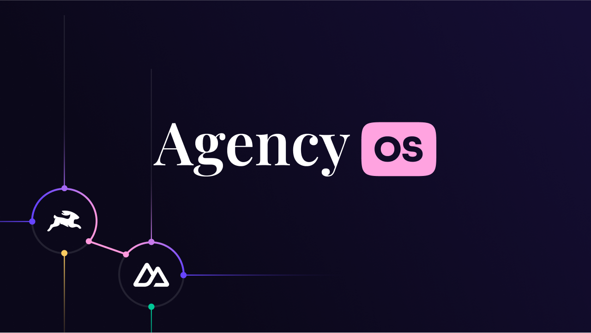

<a href="https://directus.io" target="_blank">
  
  <h1 align="center">Agency OS</h1>
</a>

<p align="center">Fully complete, opinionated agency website template. Nuxt 3 Frontend + Directus for Headless CMS / Backend.</p>

<p align="center"><em>Brought to you by partnership magic ✨ between <a href="https://directus.io" target="_blank">Directus</a> and <a href="https://nuxtlabs.com" target="_blank">NuxtLabs</a>.</em>
</p>

<p align="center">
  <a href="#introduction"><strong>Introduction</strong></a> ·
  <a href="#installation-and-development"><strong>🚧 Installation and Development</strong></a> ·
  <a href="#deployment"><strong>🚢 Deployment</strong></a> ·
  <a href="#features"><strong>⭐ Features</strong></a> ·
  <a href="#stack"><strong>🧰 Tech Stack</strong></a> ·
  <a href="#other-resources"><strong>💼 Other Resources</strong></a> ·
  <a href="#contributors"><strong>👥 Contributors</strong></a>
</p>
<br/>

<br />

# Introduction

Spin up a beautiful site for your agency or freelancing business in minutes. Or use Agency OS as the foundation for your next client project.

[**-> View The Demo Site**](https://agencyos.dev/)

**Features**

- Complete Nuxt 3 website example
- Built-in Directus - Headless CMS support
- Tailwind CSS and HeadlessUI
- Dynamic Page Builder (M2A Interface) within Directus
- Blog posts and categories
- Projects pages
- Dynamic form generation with validation
- Dynamic social image generation
- SEO support
- Global search component and API route
- Redirects module
- Ready to use common components like modals, dropdowns, and file upload input
- Common utilities so you don't need to include yet another package
- Easy SVG Icons using Nuxt Icon module
- Google Fonts support
- ESLint and Prettier already configured
- Full Dark mode support
- Written in Typescript

<br />

# 🚧 Installation and Development

## Directus - Headless CMS

### 1 - Register for a Directus Cloud account

[https://directus.cloud/register](https://directus.cloud/register)

If you're prefer the self-hosted version, you can find [install instructions using Docker here](https://docs.directus.io/self-hosted/quickstart.html).

### 2 - Create a new project

Make sure you save your project URL.

### 3 - Generate a static token for the admin user

You need the static token to seed the project.

1. Go to the User Directory
2. Choose the Adminstrative User
3. Scroll down to the Token field
4. Generate token and copy it
5. Save the user (don't forget to save!)

### 4 - Apply the Template

Open your terminal run the following command and simply follow the prompts.

`npx directus-template-cli apply`

1. Choose the `Agency OS` template.
2. Paste the URL to your Directus instance
3. Paste your Admin user static token
4. Wait for script to finish

---

## Nuxt - Frontend

### 1 - Clone the repo

[Use This Template](https://github.com/directus-community/agency-os/generate)

_Or from the terminal_

`git clone https://github.com/directus-community/agency-os.git your-project`

### 2 - Fix your .env file

- Change the filename `env.example` to `.env`
- Add the url to your Directus instance
- Add the static token for your admin user you generated above

If you're using Directus Cloud, it should look something like this.

```
DIRECTUS_URL="https://youruniquedomain.directus.app"
DIRECTUS_ADMIN_TOKEN="your_admin_static_token_here"
```

If you're using the self hosted version, it should look something like this.

```
DIRECTUS_URL="http://localhost:8055"
DIRECTUS_ADMIN_TOKEN="your_admin_static_token_here"
```

### 3 - Install your dependencies

`yarn install`

### 4 - Start the development server

`yarn dev`

[http://localhost:3000](http://localhost:3000/)

### 5 - Build for production when you're ready

`yarn build`

<br />

# 🚢 Deployment

## Deploying Nuxt Front End

Please check the official [Nuxt Deployment Documentation](https://nuxt.com/docs/getting-started/deployment).

### One Click Options

**Netlify**

<a href="https://app.netlify.com/start/deploy?repository=https://github.com/directus-community/agency-os#DIRECTUS_URL=https://youruniqueid.directus.app"></a>

**Vercel**

<a href="https://vercel.com/new/clone?repository-url=https%3A%2F%2Fgithub.com%2Fdirectus-community%2Fagency-os&env=DIRECTUS_URL,DIRECTUS_TOKEN&demo-title=Agency%20OS%20-%20Directus%20%2B%20Nuxt%20Project&demo-description=Fully%20complete%2C%20opinionated%20agency%20website%20template.%20Nuxt%203%20Frontend%20%2B%20Directus%20for%20Headless%20CMS%20%2F%20Backend.&demo-url=https%3A%2F%2Fagency-os.vercel.app&demo-image=https%3A%2F%2Fgithub.com%2Fdirectus-community%2Fagency-os%2Fblob%2Freadme-fixes%2Fpublic%2Flogos%2Fagencyos.png%3Fraw%3Dtrue"></a>

## Deploying Directus

If you don't want to mess with DevOps or spinning up servers, you can [spin up a new project on Directus Cloud](https://railway.app/template/2fy758) in about 90 seconds.

If you prefer self-hosting, Docker is the recommended way to deploy Directus. Please check the official [Directus Docker Guide](https://docs.directus.io/self-hosted/docker-guide.html)

<br />

# ⭐ Features

### Dynamic Page Builder

Includes 15 ready-to-go page blocks

- Hero
- Columns
- FAQs
- Call To Action
- Form
- Card Group
- Logo Cloud
- Rich Text
- Quote
- Steps
- Gallery
- Team
- Testimonial Slider
- Video
- Raw HTML

### Dynamic Forms

### Dynamic Navigation

### Dynamic Social Image Generation

### Dark Mode Support

Agency OS has full dark mode support.

Dark mode is already enabled in the `tailwind.config.js` and all the base components included have full support.

Dark mode toggling is provided by [VueUse `useDark` composable](https://vueuse.org/core/usedark/#usedark). And there is an example toggle component you can use.

If you don't wish to use dark mode, you can simply remove the composable and the `dark:` classes from the components.

### Dev Toolbar

### Guest-Author Ready

### Content Dashboard

### Pre-Built Automations

- Deploy Your Site
- Generate Social Images
- Create Slugs Automatically
- Post Approval Notifications

---

## Pre-Built Components

**Global Search**

**Typography**

- Title
- Headline
- Prose

**Image Gallery**

**Accordion**

**Badges**

**Modals**

**Dropdown**

**Alert**

**Video**

**Buttons**

<br />

# 🧰 Tech Stack

<a href="https://nuxt.com" target="_blank"></a>

## Nuxt

Build your next Vue.js application with confidence using Nuxt. An open source framework under MIT license that makes web development simple and powerful. The leading Vue framework that handles routing, server side rendering, and more.

[Learn more about Nuxt](https://nuxt.com)

<br />

<a href="https://directus.io" target="_blank"></a>

## Directus

Directus is a headless CMS that instantly turns your SQL database into REST and GraphQL APIs and gives you a beautiful, intuitive no-code app to manage all your content and data.
But it's also more than just a headless CMS. It’s an open data platform that has all the tools you need for creating, managing, serving, visualizing, and even automating your data for your next web, mobile, or digital project.

For a smooth experience, the [Directus SDK](https://docs.directus.io/reference/sdk/#javascript-sdk) is already integrated for you and availably globally as a Nuxt plugin.

[Learn more about Directus](https://directus.io)

---

## UI

- [Tailwind CSS](https://tailwindcss.com/) – Utility-first CSS framework that allows you to rapidly build sites and maintain consistency across team members. There are several Tailwind Plugins installed and ready to use as well – [Typography](https://tailwindcss.com/docs/typography-plugin) and [Forms](https://tailwindcss.com/docs/plugins#forms).
- [Headless UI](https://headlessui.dev/) – Completely unstyled, fully accessible UI components.
- [FormKit](https://formkit.com/) – Form library for Vue that saves you hours of time by simplifying form creation. Includes error handling, validation, theming, and even generation from a schema out of the box.
- [Nuxt Icon](https://github.com/nuxt-modules/icon) - Adds `<Icon>` component that allows you use tons of icons. [See available icons here](https://icones.js.org/).

## Utilities

- [VueUse](https://vueuse.org/) – Collection of Vue Composition Utilities. Already installed and configured so you can just import any of the composables in their library straight away.
- [VueUse Motion](https://motion.vueuse.org/) – Composables putting your components in motion. Makes it easy to provide tasteful animations with less effort.

<br />

# 💼 Other Resources

- **[Directus Discord](https://discord.com/invite/directus)** – Join over 10k+ developers and community members to ask questions and live discussion around Directus.
- **[Nuxt Discord](https://discord.com/invite/ps2h6QT)**

<br />

# 👥 Contributors

- Bryant Gillespie ([@bryantgillespie](https://twitter.com/bryantgillespie))
